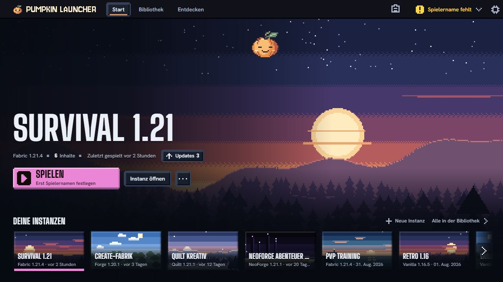
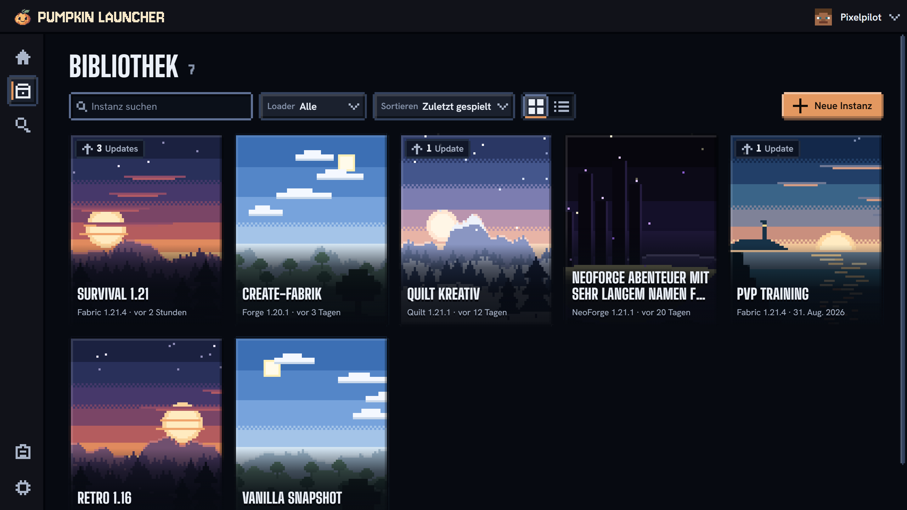
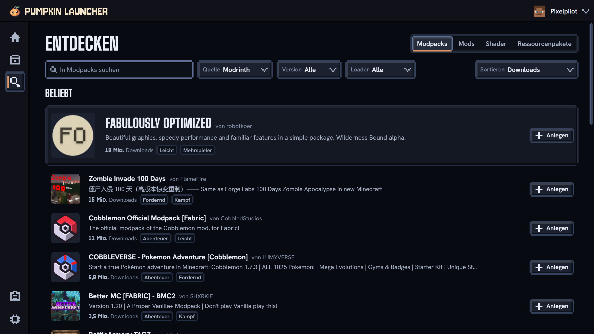

<p align="center">
  <picture>
    <source media="(prefers-color-scheme: dark)" srcset="branding/pumpkin-launcher/wordmark/light.svg">
    
  </picture>
</p>

<h3 align="center">Every world, one click.</h3>

<p align="center">
  A desktop launcher for <strong>Minecraft: Java Edition</strong> — instances, mods, modpacks and templates,<br>
  wrapped in a hand-crafted pixel-art UI. Built with Tauri&nbsp;2 (Rust) and React&nbsp;+&nbsp;TypeScript.
</p>

<p align="center">
  <a href="https://github.com/jonax1337/pumpkin-launcher/actions/workflows/ci.yml"></a>
  <a href="LICENSE"></a>
  
  
</p>

<p align="center">
  
</p>

## Features

- **Instances** — create, configure and launch isolated game instances for Vanilla, **Fabric, Forge, NeoForge and Quilt**; give each its own icon (pixel icon or picture), scene and notes
- **Per-instance launch settings** — own account, RAM (maximum and minimum), Java, window size or fullscreen, JVM and game arguments; total playtime per instance. Instances without their own values follow the launcher defaults in Settings › Java & Start (RAM, Java, JVM preset, window), which also decide what the launcher does when the game starts
- **Library** — search, filter by loader and Minecraft version, sort by last played, name, created or playtime; collapsible, reorderable groups; select several instances to group, export or delete them at once
- **Mods & modpacks** — browse, search and install from [Modrinth](https://modrinth.com), plus CurseForge, FTB and Technic modpacks, directly in the launcher. Installed Modrinth content updates on request (before several updates at once you see the old and new state with the changelog, and afterwards an undo); pick any version (also an older one) or pin a mod to keep it where it is. File sizes, dates and hints from the mod metadata (missing dependency, duplicate, wrong loader or Minecraft version) show in the list
- **Modpack updates & version switching** — update an instance to a newer pack version (Modrinth, FTB, Technic, CurseForge when every file downloads directly; a newer `.mrpack` file for instances imported from a file) without losing worlds or your own changes: every world is backed up first, files you changed stay, and an interrupted update is rolled back. Change an instance's Minecraft version or loader after a check of what will be updated, added or switched off, in place or as a copy
- **Resource packs & shaders** — choose which resource packs are active and in which order, and pick the Iris shader pack, right from the content list (written to `options.txt` and the Iris config while the game is not running)
- **Modpack import** — `.mrpack` files by drag & drop or file picker and CurseForge `.zip` files through the file picker; the installer is set up to register `.mrpack` files so a double-click opens the launcher's import dialog
- **Your own files** — drop `.jar` mods, resource packs and shader packs onto an instance; files Modrinth knows (by SHA-1) still get updates
- **Switch in one click** — import instances from Prism Launcher / MultiMC, Modrinth App, CurseForge App and ATLauncher with worlds, mods and settings (plus notes, group and icon where the other launcher has them); the other launcher stays untouched, and its commands, Java agents and class-path arguments are never taken over
- **Screenshots** — browse every instance's F2 screenshots by day, flip through them full window with zoom, copy one to the clipboard, open them in your image viewer, show them in your file manager, or select several and move them to the trash (with undo)
- **Duplicate & export** — copy an instance to experiment safely, or share it as a `.mrpack` with your own pack name, version and description (Modrinth mods linked, everything else embedded; worlds optional, no size limit); export several instances into one folder in one go without overwriting anything. Both run in the task menu and can be cancelled
- **Worlds & servers** — see an instance's worlds and server list, back up and restore worlds (deleting backs up first; optionally every changed world is backed up before the game starts, keeping the newest 1–50 automatic backups per world), import a world from a zip, edit servers and see their player count and ping, and jump straight into a world (Minecraft 1.20+) or onto a server with Quick Play; the home screen offers to continue where you last went. Deleting an instance offers to copy its world backups out first
- **Datapacks per world** — add `.zip` datapacks to a world by drag & drop, or install them from Modrinth (in the world's panel or in Discover, picking instance and world); see which ones the game has enabled, move unwanted ones to the recycle bin
- **Templates** — save an instance (mods, resource and shader packs, config, options) and start new ones from it; share a template as a `.mrpack` file or add one you received
- **Microsoft login** in the browser, with a device code as fallback (see [status](#status) below); offline player names only in development builds or next to a signed-in Microsoft account
- **Skins & capes** — keep a local skin library (classic or slim) with lit 3D previews you can turn and tilt, with your cape on its back. Add skins from a PNG file, by drop, or by typing a player's name (no account needed), then use one and pick your cape through the official Minecraft API (Microsoft accounts)
- **Quality-of-life** — crash detection with per-instance logs, the logs of the last 10 sessions per instance, likely culprit mods named from the crash report, resumable downloads, automatic RAM detection, Java installations found on your computer, a storage overview (space per instance, shared files, clear the unused mod cache), one-click log sharing via mclo.gs (access tokens, your user name in paths and e-mail addresses removed first) and a debug info without personal data for bug reports
- **Auto-updates** — signed updates from GitHub Releases, installed only when you say so and never while Minecraft or a task (download, import, export, world backup) is running; a second launch just focuses the open window
- **Seasonal branding** 🎃 — mascot, accent colors and window/taskbar icon switch automatically with the calendar (spring, summer, Halloween, winter)
- **German & English UI** — the interface follows your system language or your choice in Settings; backend errors are translated too, only a few remaining messages stay German
- **Accessibility** — keyboard shortcuts (Ctrl/Cmd+1…4 switch area, Ctrl/Cmd+, settings, Ctrl/Cmd+N new instance, Ctrl/Cmd+Enter play, Ctrl/Cmd+F or `/` search, `?` lists them all), a skip link, text size (normal, large, larger), motion off, and a Windows high-contrast mode
- **Discord Rich Presence** — optional and off by default: shows friends that you are playing, with version, loader and start time, never the world, server or instance name; the launcher only talks to the local Discord app
- **Friends** — optional and off by default: add friends with a one-time code, see who is online, and open a world to invited friends in other networks. Launchers connect directly over an encrypted peer-to-peer tunnel (iroh) and fall back to a relay server. Friends networking/actions need consent and a Microsoft account; direct peers see each other's IP address unless "Always connect through a relay" is on. See [Friends](docs/friends/README.md)
- **Pumpkin Bridge** — the launcher-injected client mod has a detached Pumpkin-logo entry in Minecraft's title and pause menus, a tile home and nested feature screens. Friends is its first module; the shared Bridge remains available when Friends is disabled. The full UI currently ships on the supported Fabric nodes; Forge/NeoForge nodes remain tracers. See [the mod](mod/README.md)
- **Pixelkino UI** — a custom pixel design system with a canvas scene engine, pixel icons and a frameless window. See [the design spec](docs/design/PIXELKINO.md)

<p align="center">
  
  
</p>

## Status

Pumpkin Launcher is in beta (v2.0.x). Install, launch, content, worlds, skins, import, duplicate/export and auto-update are in place and tested on Windows. Linux (AppImage, `.deb`) and macOS (universal `.dmg`) are built by the release workflow and their backend is tested in CI on every change, but they have not been tried on real machines yet, so expect rough edges there. Modpack updates, version switching and a few other recent additions (the `.mrpack` file association, Java detection, the window actions of the "When the game starts" setting) are covered by backend tests or the browser mock but have not yet been verified in a real app build.

> **Microsoft login:** Mojang has approved Pumpkin Launcher's own Azure app, so you can sign in with your Microsoft account. Microsoft must approve each launcher's app before `minecraftservices.com` accepts it; a fork registers its own Azure app and changes `DEFAULT_CLIENT_ID` in `src-tauri/src/services/auth/mod.rs`, and until that app is approved the final Minecraft step returns 403 and the launcher says so. How to register and approve a client ID is documented in [`docs/ACCOUNT-SETUP.md`](docs/ACCOUNT-SETUP.md).

> **Friends:** new and not yet called stable. The tests on two PCs in different real networks are still to be run ([verification record](docs/friends/VERIFICATION.md)), so expect rough edges. Release builds cannot connect friends until our own relay is deployed; debug and closed-beta builds also use n0's public relays, with an explicit opt-in.

## Getting started

### Platforms

| | Package | Notes |
|---|---|---|
| **Windows** 10/11 (x64) | NSIS installer | Not code-signed yet: SmartScreen asks once |
| **Linux** (x64) | AppImage, `.deb` | Needs WebKitGTK 4.1 (e.g. Ubuntu 22.04+, Debian 12+); Microsoft accounts need a Secret Service keyring (GNOME Keyring, KWallet) |
| **macOS** (Apple Silicon and Intel) | Universal `.dmg` | Not notarized: open it once via right-click → Open, see [Releasing](docs/RELEASING.md#macos-gatekeeper). Minecraft up to 1.18.2 runs on Intel Java and needs Rosetta 2 on Apple Silicon (`softwareupdate --install-rosetta --agree-to-license`) |

### Prerequisites

- **Node 24** and **pnpm 11** (`corepack enable`)
- **Rust** (stable toolchain; on Windows MSVC)
- **Windows**: WebView2 Runtime (preinstalled on Windows 11) and MSVC Build Tools
- **Linux** (Debian/Ubuntu; other distros see the [Tauri prerequisites](https://v2.tauri.app/start/prerequisites/#linux)):
  ```bash
  sudo apt install build-essential curl file libwebkit2gtk-4.1-dev libxdo-dev libssl-dev libayatana-appindicator3-dev librsvg2-dev
  ```
- **macOS**: Xcode Command Line Tools (`xcode-select --install`)

### Develop

```bash
pnpm install
pnpm tauri dev     # desktop app with hot reload
pnpm dev:friends   # same, with the friends directory attached (add by Minecraft name)
pnpm tauri:remote  # same, but without scene animation (for remote-desktop sessions)
pnpm dev           # frontend only in the browser (http://localhost:1420, mock data)
```

Log level via `RUST_LOG`, e.g. `RUST_LOG=debug pnpm tauri dev`.

### Build & checks

```bash
pnpm build                        # frontend (sync branding icons, tsc, vite build)
cd src-tauri && cargo check       # backend
cd src-tauri && cargo test        # backend tests
pnpm tauri build                  # installers for your OS (needs the updater signing key, see docs/RELEASING.md)
pnpm check:branding               # seasonal calendar & branding assets
pnpm check:lib                    # frontend helpers (Modrinth, formatting, errors, routes, image hosts, server addresses, content list, library, names)
pnpm check:website                # website links & assets
```

## Security & verification

Details and how to report a problem: [SECURITY.md](.github/SECURITY.md). The short version:

- **Verify your download.** Every release lists `SHA256SUMS` next to the installers (`sha256sum -c SHA256SUMS`, on Windows `Get-FileHash <file>`), and the files carry a [build provenance attestation](https://docs.github.com/actions/security-for-github-actions/using-artifact-attestations): `gh attestation verify <file> --repo jonax1337/pumpkin-launcher`.
- **Updates are signed.** The updater installs only files whose [minisign](https://jedisct1.github.io/minisign/) signature matches the public key built into the app. Key ID `BB1151480C7B980A`, public key:
  ```
  RWQKmHsMSFERuyfnigkfxjS+ihR8oGrniQlrBMQeod7GB1sBtk9Lrqoz
  ```
  The same key sits in `plugins.updater.pubkey` of [`src-tauri/tauri.conf.json`](src-tauri/tauri.conf.json) (base64 of the minisign `.pub` file). To check an installer by hand, decode its `.sig` (`base64 -d file.sig > file.minisig`) and run `minisign -V -P <public key> -x file.minisig -m <file>`.
- **Downloads and archives are restricted.** Minecraft, Java and loader files come only from vetted hosts over HTTPS (Mojang, the loader Maven repositories, Maven Central), including every redirect; modpack archives are checked for path tricks and zip bombs; descriptions load images only from trusted hosts unless you click the placeholder; the app's content security policy lets the web view talk to the backend only.
- **Mods are not scanned.** The launcher checks hashes and sizes of what it downloads, but it does not check mods, modpacks or Technic packs for malware. Install content from authors you trust.
- **Your access token is visible to local programs.** Minecraft receives the session token as the `--accessToken` command-line argument, so any program on your computer that can list processes can read it while the game runs. This is how every Minecraft launcher works. Refresh tokens stay in the system keychain (Windows Credential Manager, macOS Keychain, or a Secret Service such as GNOME Keyring or KWallet on Linux), never in plain files.
- **What the launcher talks to** is listed in *Settings › About › Privacy*. There are no trackers and no telemetry.

## Project layout

```
src/            React frontend (pages, components, pixel design system)
src-tauri/      Rust backend (commands, models, services, state, error)
branding/       released brand assets per season + generators
docs/           architecture, design spec, account setup
website/        standalone marketing website (static, no tracker)
media/          launch video source (HyperFrames, YouTube + TikTok cuts)
scripts/        build helper scripts
proxy/          Cloudflare Worker holding the CurseForge API key (forks need their own key and worker)
```

Details: [Architecture](docs/ARCHITECTURE.md) · [Releasing](docs/RELEASING.md) · [Pixelkino design spec](docs/design/PIXELKINO.md) · [Friends](docs/friends/README.md) · [Branding](branding/pumpkin-launcher/README.md) · [Website](website/README.md) · [Launch video](media/launch-video/README.md) · [CurseForge proxy](proxy/README.md)

Instances, templates, accounts and skins are stored as JSON in the app data directory (Windows: `%APPDATA%\dev.laux.launcher\`, Linux: `~/.local/share/dev.laux.launcher/`, macOS: `~/Library/Application Support/dev.laux.launcher/`). The technical identifier stays `dev.laux.launcher` so existing data keeps being found.

## Marketing website

The repo also contains the [website/](website/) folder — a standalone static site with the same Pixelkino look, automatically deployed to [jonax1337.github.io/pumpkin-launcher](https://jonax1337.github.io/pumpkin-launcher/) via GitHub Pages. Locally: `pnpm dev:website` serves it on port 1430, `pnpm build:website` produces the self-contained `website/dist/` folder. No trackers, no external requests.

## Contributing

Issues and pull requests are welcome! See [CONTRIBUTING.md](CONTRIBUTING.md) for the development setup and conventions. For security issues, please refer to [SECURITY.md](.github/SECURITY.md) instead of opening a public issue.

## License

Released under the [Apache License 2.0](LICENSE).

Pumpkin Launcher is not affiliated with, endorsed by, or associated with Mojang, Microsoft, or Modrinth. "Minecraft" is a trademark of Mojang Synergies AB.
